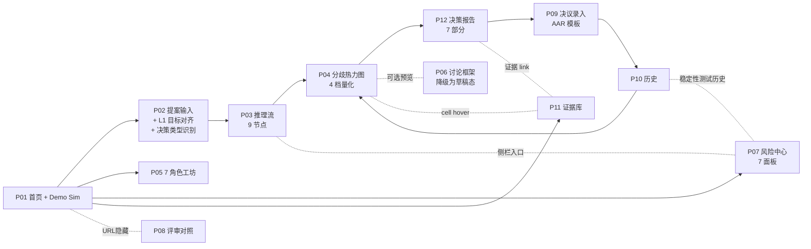

# 所有页面(v2)

> 🔥 **v2 升级(2026-05-23)**:新增 **P11 证据库** + **P12 决策报告**。P06 从 v1 的核心位置降级为"快速预览"。

> P0 = 第一版必须做,P1 = 第一版做完再加,P2 = 以后再说。

## 页面清单(按用户路径排)

| 页面 | 一句话作用 | 重要程度 | 谁会用 |
| --- | --- | --- | --- |
| [P01-home](P01-home.md) | 首页:新建提案入口 + Demo 一键模拟器 | P0 必须做 | 提案人 / 路演者 |
| [P02-proposal-intake](P02-proposal-intake.md) | 提案输入 + **目标对齐(L1)+ 决策类型识别** | P0 必须做 | 提案人 |
| [P03-analysis-stream](P03-analysis-stream.md) | 推理过程流式展示(9 节点 / 含降级 / HITL / Blind First-Vote) | P0 必须做 | 提案人(等待中) |
| [P04-diff-heatmap](P04-diff-heatmap.md) | **分歧热力图(4 档量化 + 动态权重显示)** | P0 必须做 | 决策者 / 评审人 |
| [P05-persona-workshop](P05-persona-workshop.md) | **7 角色 Persona 工坊(含利益边界 + 天然冲突)** | P0 必须做 | 业务负责人 |
| [P06-discussion-frame](P06-discussion-frame.md) | 讨论框架(v2 降级为快速预览) | P1 可选 | 提案人 |
| [P07-safety-center](P07-safety-center.md) | **风险护栏中心(7 面板 + 稳定性测试)** | P0 必须做 | 合规 / 管理者 |
| [P08-judge-cheatsheet](P08-judge-cheatsheet.md) | 评审视角对照页(URL 隐藏:`/judge-view`) | P0 必须做 | 路演评审 |
| [P09-decision-log](P09-decision-log.md) | **决议录入(AAR 模板)** | P1 想做 | 提案人 |
| [P10-history](P10-history.md) | 历史提案 / Persona 演化 + **稳定性测试历史** | P1 想做 | 总监 / 提案人 |
| **[P11-evidence-library](P11-evidence-library.md)** | **证据库管理(v2 新增)** | P0 必须做 | 业务负责人 / 路演 |
| **[P12-decision-report](P12-decision-report.md)** | **决策报告(v2 新增,7 部分)** | P0 必须做 | 决策者 / 提案人 |

## 页面之间怎么跳转(v2)

## 第一版包括哪些页面(v2)

**P0(必须做,10 页)**:P01 / P02 / P03 / P04 / P05 / P07 / P08 / P11 / P12 + **P06 降级但保留**

**P1(想做,2 页)**:P09 / P10

**为什么这么分(v2 调整)**:
- v2 把 P11 证据库和 P12 决策报告提到 P0,因为它们直接对应 L2 事实共识和决策报告 7 部分,是 v2 核心价值
- P06 仍保留但降级为"草稿态预览",新入口默认推 P12

**新页面对评审 6 维度的增量贡献**:
- **P11 证据库**:业务落地 + 创新(证据链可视化是亮点)+ 演示("V2 路线图"展示成熟度)
- **P12 决策报告**:业务落地(7 部分覆盖企业决策完整链路)+ 风险机制(Premortem 专节)+ 非技术可理解(纪要直接可读)
